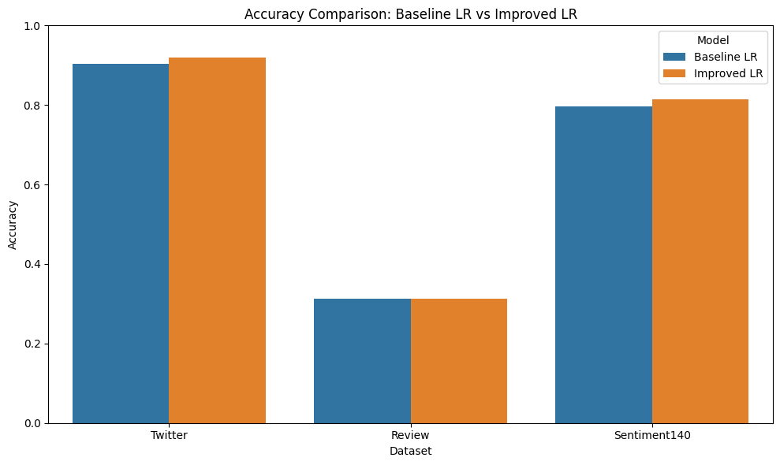
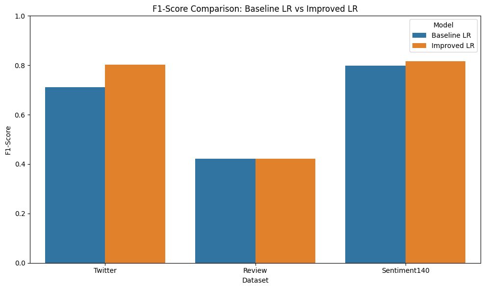

# Sentiment Analysis Tool

A production-ready sentiment research and prediction application built with Next.js 15, TypeScript, FastAPI, scikit-learn, and Recharts. The migration preserves the original Naive Bayes, Logistic Regression, Improved Logistic Regression, and Linear SVM implementations and exposes the complete research workflow through a responsive SaaS interface.

## Product areas

- Home
- About
- Sentiment Prediction
- Model Details
- Training Analysis
- Model Comparison
- Business Insights
- Research Methodology
- Use Cases
- Developer

The application supports text prediction, optional WAV transcription, built-in and uploaded datasets, model selection, stratified evaluation, leaderboards, accuracy/F1/training-time charts, class distribution, confusion matrices, classification reports, sample predictions, keyword charts, word clouds, and business summaries.

## Architecture

```text
frontend/  Next.js 15 App Router, TypeScript, Recharts, responsive UI
backend/   FastAPI, original model modules, evaluation and insight services
```

Text prediction and read-only research requests use the same-origin Next.js proxy under `/api/*`. Audio and dataset uploads go directly to Render to avoid Vercel's serverless request-body limit. Set both frontend backend URL variables described below.

## Local development

Requirements: Node.js 20.19+, npm, and Python 3.11-3.13.

```powershell
python -m venv .venv
.venv\Scripts\Activate.ps1
python -m pip install -r requirements.txt
python -m uvicorn backend.app:app --reload --port 8000
```

In a second terminal:

```powershell
Copy-Item frontend/.env.example frontend/.env.local
npm install
npm run dev
```

Open `http://localhost:3000`. FastAPI documentation is available locally at `http://127.0.0.1:8000/docs`.

## API

- `GET /health` - service and model readiness
- `POST /predict` - text sentiment, confidence, probability, inference time, and model
- `POST /predict/audio` - WAV transcription and Improved Logistic Regression analysis
- `GET /training-analysis` - default experiment metrics and evaluation data
- `POST /training-analysis/upload` - upload-driven experiment
- `GET /model-comparison` - complete leaderboard and evaluation payload
- `GET /business-insights` - sentiment distribution, keywords, and summary

## Production deployment

### Render backend

Configure the existing Render web service with:

- Root Directory: `backend`
- Build Command: `pip install -r requirements.txt`
- Start Command: `uvicorn app:app --host 0.0.0.0 --port $PORT`
- Health Check Path: `/health`
- `ALLOWED_ORIGINS`: the exact comma-separated origins from `backend/.env.example`

Every process automatically initializes all four deterministic model pipelines during startup and fails startup if the fixed audio model cannot load. Uploaded training experiments use an isolated registry and never replace the production inference models.

### Vercel frontend

Import this repository with:

- Root Directory: `frontend`
- Framework Preset: Next.js
- Build Command: `npm run build`
- Output Directory: leave unset
- Install Command: `npm install`

Set both `BACKEND_API_URL` and `NEXT_PUBLIC_BACKEND_API_URL` to `https://sentiment-analysis-tool-a8nd.onrender.com`. The public production frontend is `https://sentiment-analysis-tool-frontend.vercel.app`.

## Environment variables

| Variable | Project | Purpose |
| --- | --- | --- |
| `BACKEND_API_URL` | Frontend | FastAPI base URL |
| `NEXT_PUBLIC_BACKEND_API_URL` | Frontend | FastAPI base URL for direct audio uploads |
| `ALLOWED_ORIGINS` | Backend | Exact comma-separated direct browser origins |
| `LOG_LEVEL` | Backend | Backend logging level; defaults to `INFO` |
| `MAX_DATASET_UPLOAD_BYTES` | Backend | Dataset upload limit; defaults to 10 MB |
| `MAX_AUDIO_UPLOAD_BYTES` | Backend | WAV upload limit; defaults to 25 MB |
| `SPEECH_RECOGNITION_TIMEOUT_SECONDS` | Backend | Google transcription timeout; defaults to 20 seconds |

No secret is required for core text analysis. Google Speech Recognition is external and may be unavailable in restricted environments.

## Model integrity

Files under `backend/models/` preserve the original training, preprocessing, and prediction logic. Only import paths were made package-safe. No classifier hyperparameters, feature extraction choices, prediction functions, or audio post-processing rules were changed.

The original repository did not include persisted trained classifier files. It included an unused Keras tokenizer that is not referenced by the classical models. Each backend process automatically builds the same deterministic bundled-data inference pipelines at startup; prediction never depends on visiting Training Analysis. Uploaded experiments are isolated from these inference models.

## Screenshots

Live charts are rendered with Recharts. Historical research charts remain in `images/` for comparison:





## License

Released under the [MIT License](LICENSE).

## Acknowledgements

Built with Next.js, React, FastAPI, scikit-learn, pandas, NumPy, Recharts, and SpeechRecognition. See [MIGRATION_REPORT.md](MIGRATION_REPORT.md) for the complete migration record and known deployment considerations.
